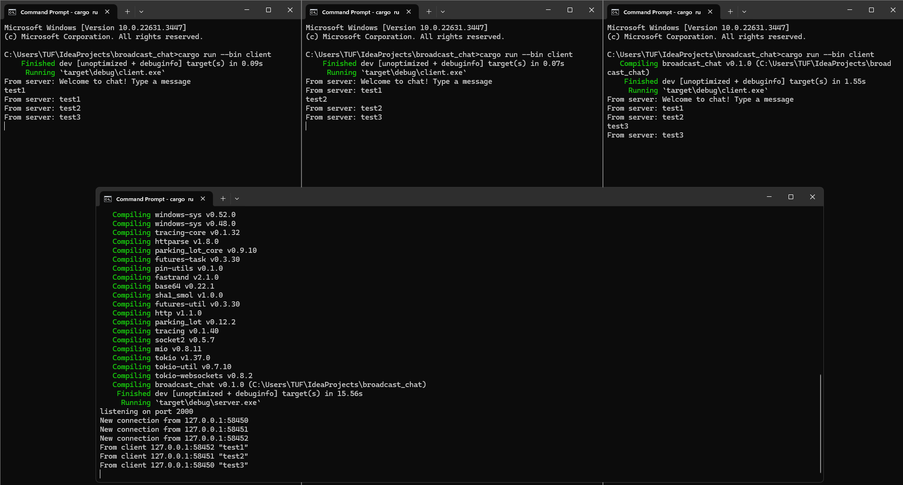
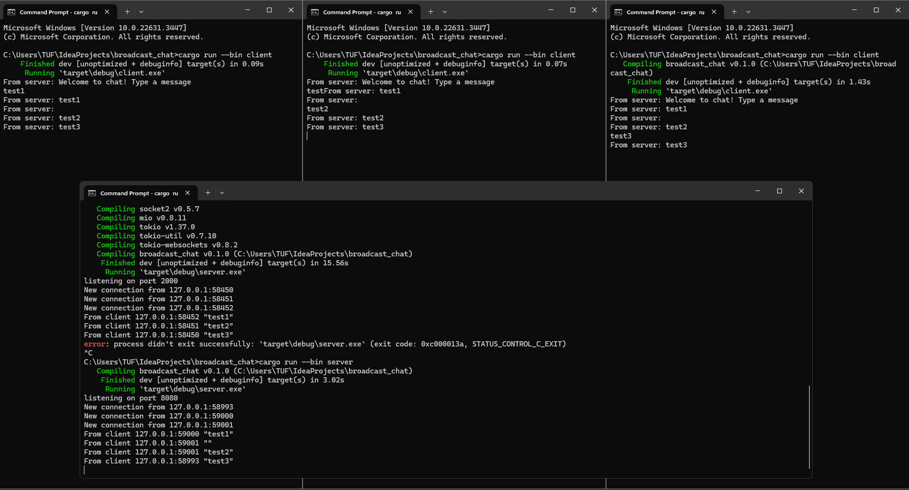
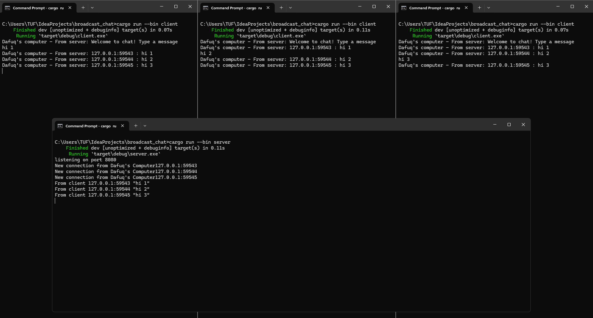

# Module 10 - Asynchronous Programming - Timer

> ##### Muhammad Daffa Grahito Triharsanto - 2206820075 - Pemrograman Lanjut B

## 2.1. Original code of broadcast chat



Untuk menjalankan server saya membuka 1 terminal dan menjalankan `cargo run --bin server` dan untuk menjalankan 3 client saya membuka 3 buah terminal dan menjalankan `cargo run --bin client` di masing-masing terminal itu. 3 client itu connected to one server dan apabila saya mengetik sesuatu di salah satu terminal, yang terjadi adalah client lain dapat melihat ketikan itu juga yaitu setelah dikirimkan ke server dan lanjut dikirimkan ke seluruh client.

## 2.2. Modifying the websocket port



Yang harus di modify agar menggunakan port 8080 ada di `client.rs` tepatnya di 
```rust
let (mut ws_stream, _) =
        ClientBuilder::from_uri(Uri::from_static("ws://127.0.0.1:8080"))
            .connect()
            .await?;
```
dan server.rs, tepatnya di:
```rust
let listener = TcpListener::bind("127.0.0.1:8080").await?;
    println!("listening on port 8080");
```

Keduanya harus mempunyai port yang sama karena jika tidak maka akan terjadi error dimana client tidak bisa menemukan port yang tepat lalu program akan terminate.

## 2.3. Small changes. Add some information to client



Dari gambar terlihat kalau terdapat informasi dari setiap sender dimana karena nama computer saya Dafuq jadi didapat hasil seperti itu. Disini saya mendapatkan nama hostname dengan menggunakan dependency `gethostname`. Saya mengganti print statement pada client dan server nya dengan menambahkan hostname sehingga kode kurang lebih bentuknya seperti ini untuk keduanya
```rust
let hostname = gethostname().into_string().unwrap_or_else(|_| "unknown".to_string());
...
println!("... {}'s ...{}", hostname, addr);
```

Dengan begini, semuanya bisa tahu dari computer/device siapa yang mengirimkan messagesnya.